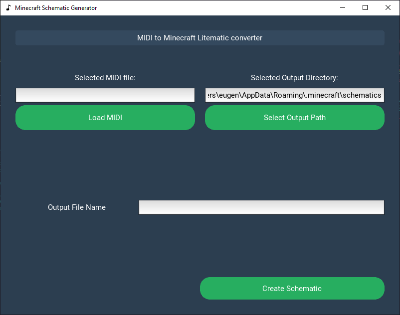
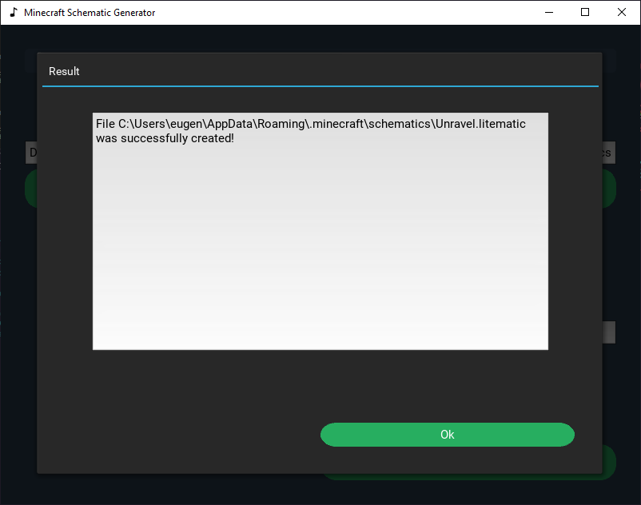

# Minecraft Noteblock Schematic Generator

Create Minecraft Noteblock Schematics easily by converting midi files to Schematic Files

This schematic generator uses [litematica](https://github.com/maruohon/litematica) schematics to create noteblock schematics. It utilizes the [litemapy](https://github.com/SmylerMC/litemapy) package to create noteblocks based of a midi file

Screenshots:

